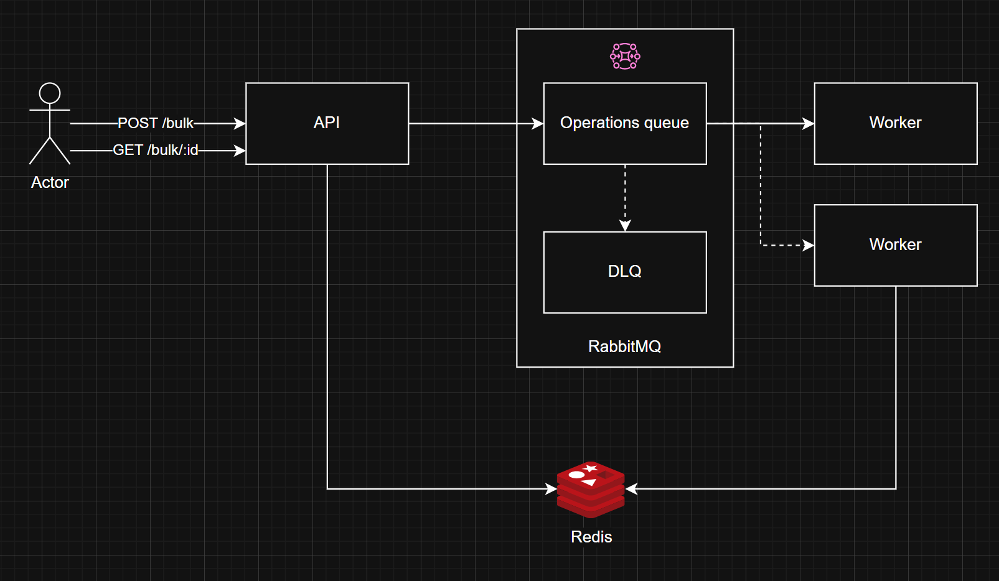

# Task

Design and describe a solution that enables safe and efficient processing of bulk requests to the endpoint POST /product/bulk with an unlimited number of items in the request payload.
Requirements:

- Request payload can have an unlimited number of items.
- Each individual operation may take up to 1000 ms due to external API calls.
- Expected load — up to 1000 bulk requests per minute.
- The system must be resilient to failures: no data loss and no client-side timeouts.
- Partial success is allowed — not all items in a bulk request need to succeed.
- Requests must be idempotent — safe to retry without duplicating results.
- The client must be able to track the processing status.

## Architecture Overview

The API accepts bulk requests at `POST /product/bulk`. Each request is assigned a unique tracking ID and enqueued in RabbitMQ for background processing. Redis is used to track the status of each operation and the overall bulk request, enabling clients to poll for results. This design ensures:

- No client-side timeouts (async processing)
- Resilience to failures (queue + status tracking)
- Idempotency (tracking IDs)

**Architectural Approach and Justification**

The chosen architecture leverages asynchronous processing to handle potentially "unlimited" bulk operations without risking client timeouts or data loss. Incoming bulk requests are immediately assigned a unique tracking ID and enqueued in RabbitMQ, a robust message broker that decouples request ingestion from processing. This ensures the API remains responsive under heavy load and provides reliable delivery and retry mechanisms in case of worker failures.

Redis is used as a fast, in-memory data store to track the status of each individual operation and the overall bulk request. This enables efficient status polling by clients and supports partial success reporting. By separating the queue (RabbitMQ) from the status store (Redis), the system achieves both high throughput and resilience. This design also supports idempotency, as each request is uniquely tracked, and allows for safe retries without duplicating work.

## Example API Request

```json
POST /product/bulk
{
  "operations": [
    { "type": "create", "product": { "name": "A", "price": 10 } },
    { "type": "update", "id": 123, "product": { "price": 12 } },
    { "type": "delete", "id": 456 }
  ]
}
```

## Example API Response

```json
202 Accepted
{
  "bulkRequestId": "bulk_1721565345_abc123xyz",
  "statusUrl": "/product/bulk/status/bulk_1721565345_abc123xyz",
  "message": "Bulk request accepted for processing."
}
```

## Example Status Polling

```json
GET /product/bulk/status/:bulk_id
{
  "in_progress": 10,
  "completed": 10,
  "failed": 10
}
```

## Architecture Diagram

```

```
